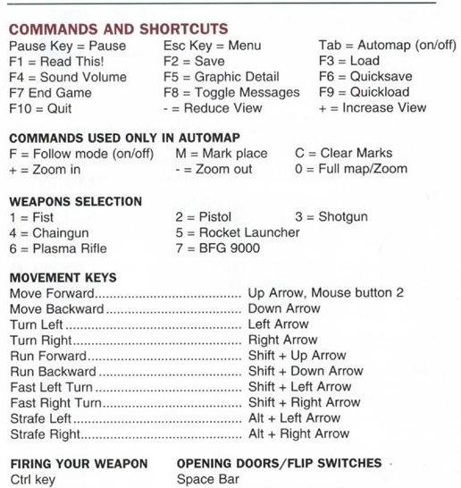

# Doomgeneric porting to RISCV
__NB__: The original Doomgeneric README is available [here](README_ORIG.md).

This personal project aims to port Doom to a virtualized RISC-V system, specifically targeting the QEMU virt machine.

The goal is to run Doom on a minimal, bare-metal virtual environment without relying on an underlying operating system. In essence, Doom is being developed as a [Unikernel](https://en.wikipedia.org/wiki/Unikernel) application, custom-tailored for the QEMU virt platform.

# Qemu virt integration

In order to interact with virt machine simple drivers have been developed for:
* [ramfb](https://wiki.osdev.org/Ramfb) - a basic framebuffer for graphical output
* [UART serial](https://wiki.osdev.org/RISC-V_Meaty_Skeleton_with_QEMU_virt_board#src/uart/uart.h) - for reading and writing characters via the console
* ["test" syscon-compatible device](https://wiki.osdev.org/RISC-V_Meaty_Skeleton_with_QEMU_virt_board#src/syscon/syscon.h) - used to trigger system shutdown
* CLINT mtime - read/write register that counts the number of cycles from the realtime clock
* CLINT interrupt - allows to implement sleep(ms) function without consuming 100% of cpu cycles
* Virtio Keyboard - read key pressed/released 

# Build
A cross-compiler for the RISC-V architecture is required.

On macOS, you can install it using Homebrew:
```shell
$ brew install riscv64-elf-gcc

# Optional: for debug with gdb
$ brew install riscv64-elf-gdb
```

To build unikernel executable:
```shell
$ make
```
# Running Doom
QEMU emulator is needed. On macOS, install it via:
```shell
$ brew install qemu
```

To run Doom on QEMU:
```shell
$ bash qemu-run.sh
```

## Control Keys



# Limitations
* no audio is supported
* ~~Game uses 100% of Qemu cpu~~

# TODOs
* code refactoring
* add audio support (they say it's hard to implement)
